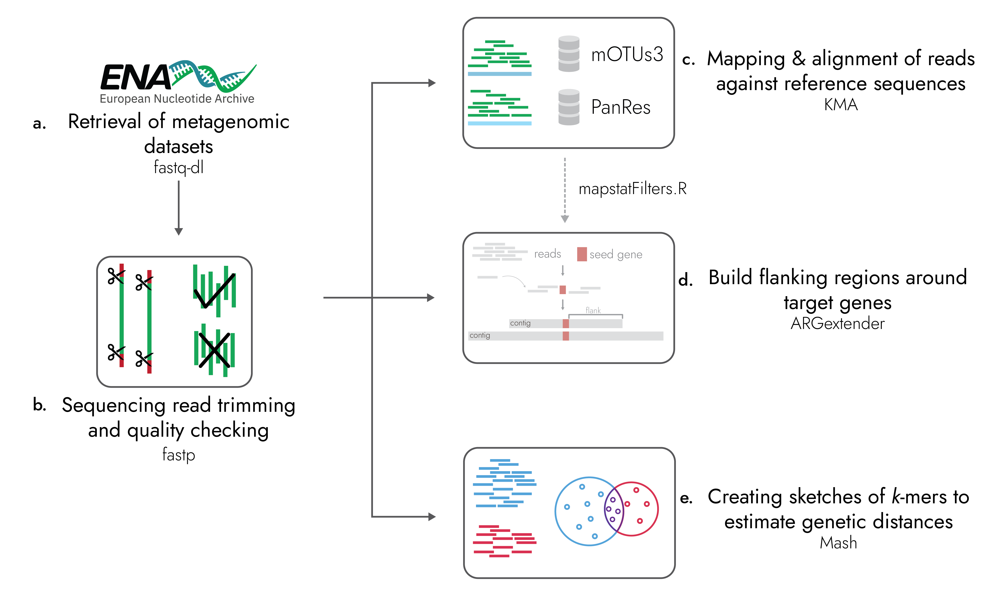

# ARGprofiler
A tool for large-scale analysis of antimicrobial resistance genes (ARGs) and their flanking regions in metagenomic datasets.



## Introduction

ARGprofiler is a newly developed Snakemake pipeline designed to analyze ARGs' read distances, abundances, and genomic flanking regions in metagenomic sequencing data. It has been adapted to work for short-read sequencing datasets. The pipeline also includes the recently made PanRes database, a combined collection of current ARG databases, and ARGextender, an assembly tool for extending the genomic flanking region around genes of interest.

ARGprofiler uses the following tools:


* [``` fastq-dl ```](https://github.com/rpetit3/fastq-dl) for downloading raw reads from ENA
* [``` fastp ```](https://github.com/OpenGene/fastp) for trimming and QC of raw reads
* [``` KMA ```](https://bitbucket.org/genomicepidemiology/kma) for alignment of raw reads against reference databases
* ``` ARGextender ``` for extracting the genomic flanking regions around ARGs
* [``` Mash ```](https://github.com/marbl/Mash) for creating sketches to estimate genetic distances


The workflow is described in
> Martiny, H. M., Pyrounakis, N., Petersen, T. N., Lukjančenko, O., Aarestrup, F. M., Clausen, P. T., & Munk, P. (2024). ARGprofiler—a pipeline for large-scale analysis of antimicrobial resistance genes and their flanking regions in metagenomic datasets. Bioinformatics, 40(3), btae086. https://doi.org/10.1093/bioinformatics/btae086

## Installation

The best way to install the ARGprofiler pipeline is to clone this GitHub repository. The pipeline uses the Conda package manager to deploy the defined software packages in the specified version without requiring admin or root privileges.

```
git clone https://github.com/genomicepidemiology/ARGprofiler.git
```
This command will create the ARGprofiler directory in the current directory.

Since ARGprofiler is a Snakemake pipeline, the user should install Snakemake workflow management following the guide [here](https://snakemake.readthedocs.io/en/stable/getting_started/installation.html). 

## Input

ARGprofiler takes as input a JSON file named [`input.json`](input.json) in the following format:

```
{run_accession:{"type":READ_TYPE},"run_accession":{"type":READ_TYPE}}
```
`run_accession` is the ENA id for the read sequencing datasets, and `READ_TYPE` can be either `PAIRED` or `SINGLE`.

Example:

```
{"ERR3593315":{"type":"PAIRED"},"SRR7533096":{"type":"SINGLE"}}
```

The user can also opt to specify the name of the input file in the Snakefile (with open...).

For instructions on how to analyze unpublished sequencing reads check ``` Tips and Tricks ```
## Running ARGprofiler

The user has the option to run the pipeline either on an HPC or locally. For running on HPC, we provide the option of executing the workflow using environment modules or conda packages. 

### HPC
The user should specify the preferable option for executing the pipeline in the config file. If wanting to use a conda environment, keep ```use-conda:True```; otherwise, replace with ```use-envmodules:True```.

To run ARGprofiler on an HPC with a queuing system, the user should execute the following command:

```
snakemake --profile profile_argprofiler
```

### Locally
While we have designed ARGprofiler to run in an HPC environment (specifically [Computerome](https://www.computerome.dk/)), it is possible to run the pipeline locally. Therefore, we recommend creating a mamba environment as follows:

```{bash}
mamba env create --name argprofiler --file rules/environment_argprofiler.yaml
```

Since we are not executing ARGprofiler in HPC, the user should remove the following flag from the config file: ```cluster, cluster-config``` and add the following flag: ```cores``` (The ```cores``` flag should be changed to reflect the number of cores for Snakemake to use). 

Then activate the environment and run Snakemake:

```{bash}
mamba activate argprofiler
snakemake --profile profile_argprofiler
```

## Output

When successfully executed, ARGprofiler creates a directory named ``` results ```, where the user can find all the available results from all the analysis steps (results are separated into single and paired-reads results). More specifically:


* ``` raw_reads ``` directory contains all the downloaded sequencing datasets.
* ``` trimmed_reads ``` directory contains all the trimmed sequencing datasets.
* ``` kma_mOTUs ``` directory contains all the alignment result files with the mOTUs database.
	* .res = A result overview giving the most common statistics for each mapped template.
	* .mapstat = Summarized read abundances.
	* .fsa.gz = The consensus sequences are drawn from the alignments (zipped).
	* .mat.gz = Base counts on each position in each template (zipped).
	* .vcf.gz = Sequence variations.
* ``` kma_panres ``` directory contains all the alignment result files with the PanRes database.
	* .res = A result overview giving the most common statistics for each mapped template.
	* .mapstat = Summarized read abundances.
	* .mapstat.filtered = Filtered summarized read abundances (Learn more about our filtering scheme here).
	* .bam = Alignment information (compressed).
	* .fsa.gz = The consensus sequences are drawn from the alignments (zipped).
	* .mat.gz = Base counts on each position in each template (zipped).
	* .vcf.gz = Sequence variations.
* ``` argextender ``` directory for extracting the genomic flanking regions around ARGs.
	* .fasta = fasta file with the extracted flanking sequences.
	* .frag.gz = overview file that contains information on the following: Contig_seq, Number of matching ARGs, Alignment score, Start pos., End pos., Template name, Contig name.
	* .frag_raw.gz = Similar file with fra.gz but with all ARGs that can align to any of the contigs. Read, Number of equally well mapping templates, Mapping score, Start pos., End pos. (w.r.t. template), Choosen template(s).
	* gfa.gz =  Sequence graph.
* ``` Mash ``` directory contains the mash sketches for each sequencing dataset.

## Tips and Tricks

* For the analysis of unpublished sequencing reads, the user should create a new directory by the name ``` local_reads ``` and place the sequencing reads (both paired and single) in that directory. 
* The pipeline makes use of Snakemake profiles to specify the configuration of the pipeline. The required flags are specified in the files of the ``` profile_argprofiler ``` directory.
	
	* We provide a [config file](profile_argprofiler/config.yaml) for executing the pipeline in an HPC with qsub
* To save space ARGprofiler, by default, removes the raw and trimmed reads from each sample upon successful competition of all rules.
* Besides the regular output files, the kma_PanRes rule also outputs a BAM file.
* ARGextender will, by default, run until there is nothing more to extend.
* The user should create a ``` logs ``` directory in the main directory. Log files for each job will be placed there.

## Citation
> Martiny, H. M., Pyrounakis, N., Petersen, T. N., Lukjančenko, O., Aarestrup, F. M., Clausen, P. T., & Munk, P. (2024). ARGprofiler—a pipeline for large-scale analysis of antimicrobial resistance genes and their flanking regions in metagenomic datasets. Bioinformatics, btae086. https://doi.org/10.1093/bioinformatics/btae086


### Accompanying code and data for ARGprofiler publication
#### Code
* [GeneAssimilator](https://github.com/genomicepidemiology/gene_assimilator): https://github.com/genomicepidemiology/gene_assimilator
* Benchmark of microbial profilers: https://github.com/genomicepidemiology/argprofiler-tax-benchmark
* Jupyter Notebooks supporting figures and tables included in manuscript: https://github.com/genomicepidemiology/argprofiler-paper-notebooks

#### Data
* MetalResistance: https://doi.org/10.5281/zenodo.8108201
* PanRes: https://doi.org/10.5281/zenodo.8055115
* Results of benchmarking microbial profilers: https://doi.org/10.5281/zenodo.7923774
* De novo assemblies: [PRJEB40798](https://www.ebi.ac.uk/ena/browser/view/PRJEB40798), [PRJEB40816](https://www.ebi.ac.uk/ena/browser/view/PRJEB40816), [PRJEB40815](https://www.ebi.ac.uk/ena/browser/view/PRJEB40815), [PRJEB27621](https://www.ebi.ac.uk/ena/browser/view/PRJEB27621), [ERP015409](https://www.ebi.ac.uk/ena/browser/view/ERP015409)
* Copenhagen sewage collection: [PRJEB34633](https://www.ebi.ac.uk/ena/browser/view/PRJEB34633)
* Repeated sequencing of a single Copenhagen sewage sample: [PRJEB63576](https://www.ebi.ac.uk/ena/browser/view/PRJEB63576)

## Feedback and issues
We welcome any comments, bug reports, and suggestions, as they will help us improve ARGprofiler. You can leave comments and bug reports in the [repository issue tracker](https://github.com/genomicepidemiology/ARGprofiler/issues) or reach out by e-mail to nipy@food.dtu.dk or hanmar@food.dtu.dk

