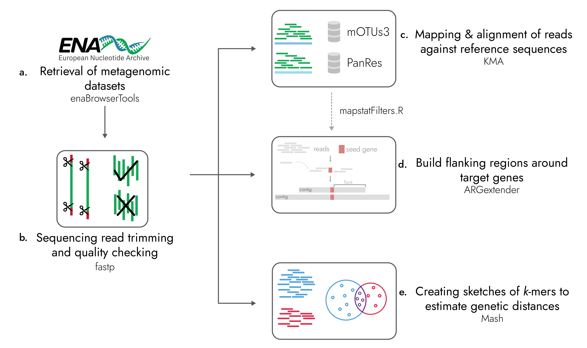

# ARGfinder
A tool for large-scale analysis of antimicrobial resistance genes (ARGs) and their flanking regions in metagenomic datasets.



## Introduction

ARGfinder is a newly developed Snakemake pipeline designed to analyze read distances, abundances, and genomic flanking regions of ARGs in metagenomic sequencing data. It has been adapted to work for short-read sequencing datasets. The pipeline also includes the recently made PanRes database, a combined collection of current ARG databases, and ARGextender, an assembly tool for extending the genomic flanking region around genes of interest.

ARGfinder uses the following tools:


* [``` enaBrowserTools ```](https://github.com/enasequence/enaBrowserTools) for downloading raw reads from ENA
* [``` fastp ```](https://github.com/OpenGene/fastp) for trimming and QC of raw reads
* [``` KMA ```](https://bitbucket.org/genomicepidemiology/kma) for alignment of raw reads against reference databases
* ``` ARGextender ``` for extracting the genomic flanking regions around ARGs
* [``` Mash ```](https://github.com/marbl/Mash) for creating sketches to estimate genetic distances


The tool is described in *Paper_here*

## Installation

The best way to install the ARGfinder pipeline is to clone this GitHub repository. The pipeline uses the Conda package manager to deploy the defined software packages in the specified version without requiring admin or root privileges.

```
git clone https://github.com/genomicepidemiology/ARGfinder.git
```
This command will create the ARGfinder directory in the current directory.

Since ARGfinder is a Snakemake pipeline, the user should install Snakemake workflow management following the guide [here](https://snakemake.readthedocs.io/en/stable/getting_started/installation.html). 

## Getting started

There are some prerequisites for using ARGfinder:

* The user needs to download two reference databases (mOTUs and PanRes), place them in the correct directory, and then index them with KMA. 

	* Create mOTUs and PanRes subdirectories in the ``` prerequisites ``` directory.

	* For ``` mOTUs``` the user has to download the database from Zenodo, unzip it, and then index it with KMA:
		1. Move to the mOTUs directory in the ``` prerequisites ``` directory
		2. `wget https://zenodo.org/record/5140350/files/db_mOTU_v3.0.1.tar.gz`
		3. `tar -xzf db_mOTU_v3.0.1.tar.gz`
		4. `kma index -i db_mOTU/db_mOTU_DB_CEN.fasta -o db_mOTU` (For KMA instructions you can check  <a href="https://bitbucket.org/genomicepidemiology/kma/src/master/">KMA</a>)

	* For ``` PanRes``` the user has to download the database from Zenodo, unzip it, and then index it with KMA:
		1. Move to PanRes directory in the ``` prerequisites ``` directory
		2. `wget https://zenodo.org/record/`
		3. `tar -xzf` 
		4. `kma index -i pan.fa -o panres_db` (For KMA instructions, you can check  <a href="https://bitbucket.org/genomicepidemiology/kma/src/master/">KMA</a>)

* The pipeline makes use of Snakemake profiles to specify the configuration of the pipeline. The required flags are specified in the files of the ``` profile_argfinder ``` directory.
	
	* We provide a [config file](profile_argfinder/config.yaml) for executing the pipeline in an HPC with qsub

## Input

ARGfinder takes as input a JSON file with the following format:

```
{run_accession:{"type":READ_TYPE},"run_accession":{"type":READ_TYPE}}
```
`run_accession` is the ENA id for the read sequencing datasets, and `READ_TYPE` can be either `PAIRED` or `SINGLE`.

Example:

```
{"ERR3593315":{"type":"PAIRED"},"SRR7533096":{"type":"SINGLE"}}
```

The user can also opt to specify the name of the input file in the Snakefile (with open...).

## Running ARGfinder

To run ARGfinder, the user should execute the following command:

```
snakemake --profile profile_argfinder
```

Reminder: execution of the pipeline requires installing the Snakemake workflow management beforehand.

## Output

When successfully executed, ARGfinder creates a directory named ``` results ```, where the user can find all the available results from all the analysis steps (results are separated into single and paired-reads results). More specifically:


* ``` raw_reads ``` directory contains all the downloaded sequencing datasets + benchmarking files.
* ``` trimmed_reads ``` directory contains all the trimmed sequencing datasets + benchmarking files.
* ``` kma_mOTUs ``` directory contains all the alignment result files with the mOTUs database + benchmarking files.
	* res file = A result overview giving the most common statistics for each mapped template.
	* mapstat file = Summarized read abundancies.
	* fsa.gz = The consensus sequences are drawn from the alignments (zipped).
	* mat.gz = Base counts on each position in each template (zipped).
	* vcf.gz = Sequence variations.
* ``` kma_panres ``` directory contains all the alignment result files with the PanRes database + benchmarking files..
	* res file = A result overview giving the most common statistics for each mapped template.
	* mapstat file = Summarized read abundancies.
	* mapstat.filtered file = Filtered summarized read abundancies (Learn more about our filtering scheme here).
	* bam file = Alignment information (compressed).
	* fsa.gz = The consensus sequences are drawn from the alignments (zipped).
	* mat.gz = Base counts on each position in each template (zipped).
	* vcf.gz = Sequence variations.
* ``` argextender ``` directory for extracting the genomic flanking regions around ARGs + benchmarking files.
	* fasta file = fasta file with the extracted flanking sequences.
	* frag.gz file = overview file that contains information on the following: Contig_seq, Number of matching ARGs, Alignment score, Start pos., End pos., Template name, Contig name.
	* frag_raw.gz = Similar file with fra.gz but with all ARGs that can align to any of the contigs. Read, Number of equally well mapping templates, Mapping score, Start pos., End pos. (w.r.t. template), Choosen template(s).
	* gfa.gz =  Sequence graph.
* ``` Mash ``` directory contains the mash sketches for each sequecning dataset + benchmarking files.

## Tips and Tricks

* To save space ARGfinder removes the raw and trimmed reads from each sample upon successful competition of all rules. 
* Besides the regular output files, the kma_PanRes rule also outputs a BAM file.
* ARGextender will, by default, run until there is nothing more to extend.
* The user should create a ``` logs ``` directory in the main directory if they wish to have log files for each job.

## Citation

## Feedback and issues
We welcome any comments, bug reports, and suggestions, as they will help us improve ARGfinder. You can leave comments and bug reports in the [repository issue tracker](https://github.com/genomicepidemiology/ARGfinder/issues) or reach out by e-mail to nipy@food.dtu.dk or hanmar@food.dtu.dk
